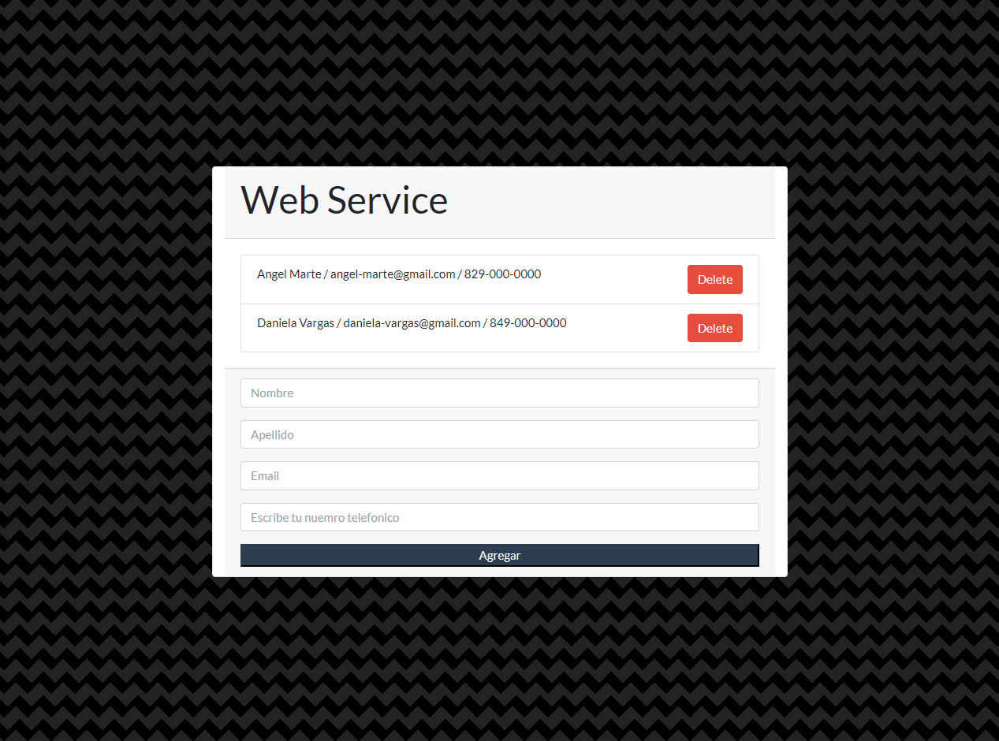

# contact webservices nodejs
## Tarea 5 de Angel Marte, Ejemplo de Screemshot desde cada dispositivo
###servicio Web utilizando la librería express de nodeJS que haga las dos operaciones básicas de listar y almacenar contactos 

